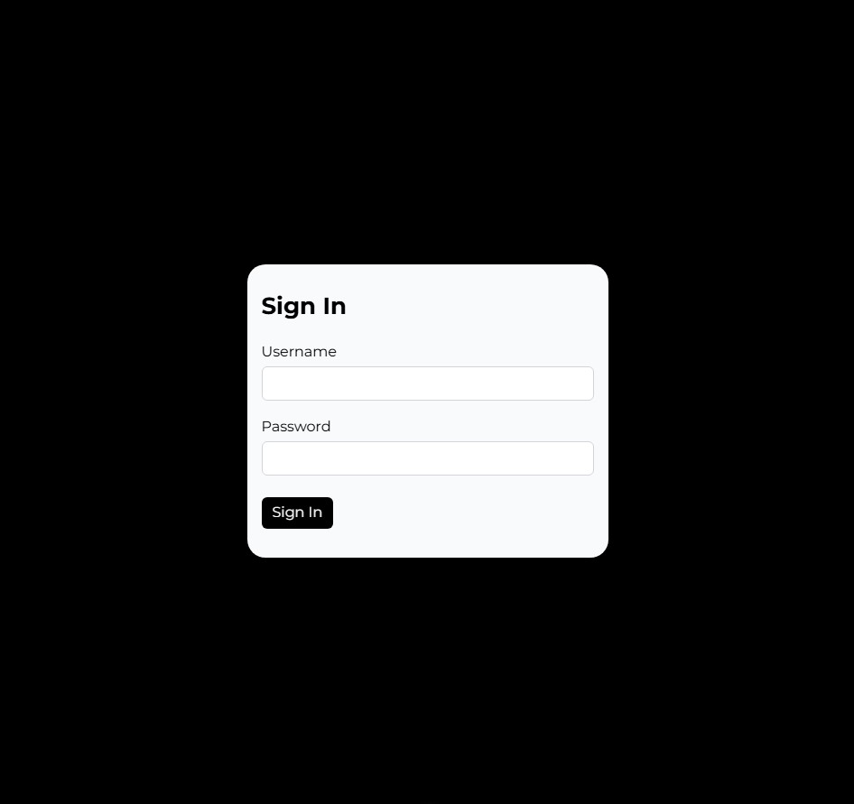
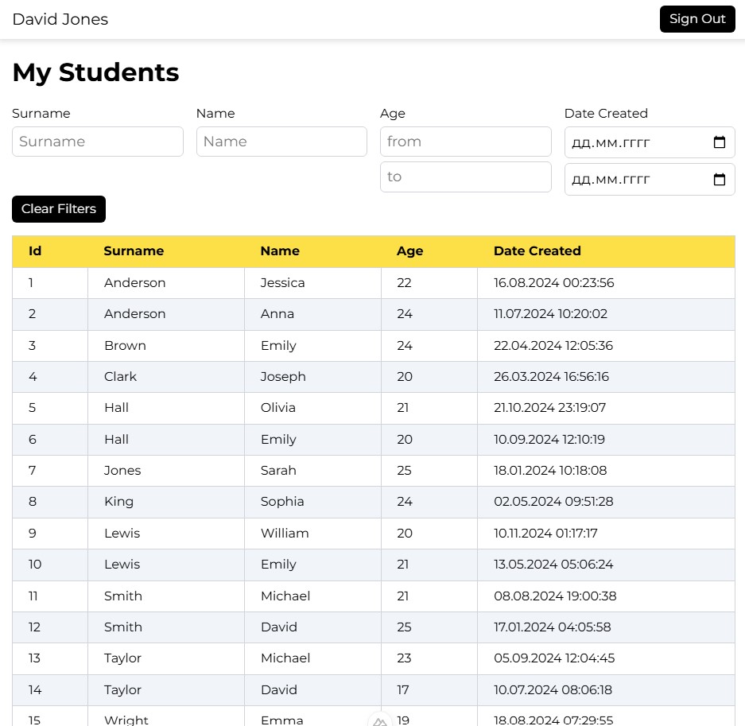

# Тестовое задание

<div style="display: flex; gap: 10px;">
  
  
</div>

## Страница аутентификации "/auth".
- Применена валидация на обязательное заполнение полей, которая блокирует отправку формы и подсвечивает соответствующие поля.
- При отправке формы, в случае не верного логина или пароля, форма выводит сообщение об ошибке. (Список юзеров находится в server/db/users.json).
- При успешной аутентификации, происходит запись токена в coocie и преход на страницу аккаунта "/account".

## Страница аккаунта "account"/.
- При переходе на страницу аккаунта срабатывает "middleware/checkToken.ts", в случае отсутствия токена перенаправляет на страницу аутентификации.
- Если токен присутствует, то срабатывает следующий "middleware/account.ts", который вызывает fetchGetAccountData из store, если данные получены, то они созраняются в store. Далее происходит переход на "/account", получение данных из store и отриовка таблицы.
- В случае недействительного токена сервер выбрасывает ошибку, которая перехватывается, в упомянутой выше функции fetchGetAccountData и происходит удаление токена с последующим переходом на страницу аутентификации.

## Таблица "components/studentTable/index.vue".

- Компонент принимает массив объектов с данными таблицы (любые имена ключей, занчения: number | string) и схему.
	Порядок расположения столбцов происходит в соответствии со схемой.
  
## Фильтр "components/studentTable/filter.vue".
- У компонента те же входные параметры, что и у таблицы
- При необходимости добавить фильтр для поля, нужно в схеме добавить поле filter (в объекте этого поля), а также тип данных поля.
- 	Можно указать 3 типа данных:
		'text' - фильтр строк
		'number' - фильтр чисел и строковых чисел
		'date' - приведение строк типа 'DD.MM.YYY hh:mm:ss' к дате с последующей фильтрацией
### схема отрисовки и филтрации

```
const tableSchema = ref<TableSchema[]>([
  {
    title: 'Id',
    name: 'id',
  },
  {
    title: 'Эелаемое названия колонки в таблице',
    name: 'Фактичесое название поля в объекте данных таблицы',
    filter: 'необязательное поле, добавляется при необходимости фильтрации этого поля',
  },
  {
    title: 'Name',
    name: 'name',
    filter: 'text',
  },
])
```
Поля можно установить в любой последовательности, либо исключить ненужные поля.

**Проект запускался на версии node 23.6.0**


# Nuxt Minimal Starter

Look at the [Nuxt documentation](https://nuxt.com/docs/getting-started/introduction) to learn more.

## Setup

Make sure to install dependencies:

```bash
# npm
npm install
```

## Development Server

Start the development server on `http://localhost:3000`:

```bash
# npm
npm run dev
```

## Production

Build the application for production:

```bash
# npm
npm run build
```

Locally preview production build:

```bash
# npm
npm run preview
```

Check out the [deployment documentation](https://nuxt.com/docs/getting-started/deployment) for more information.
